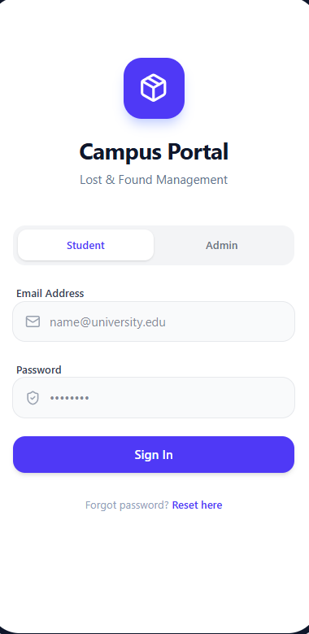
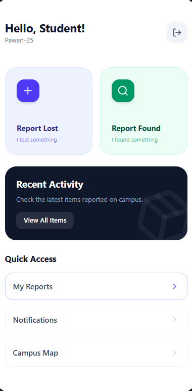
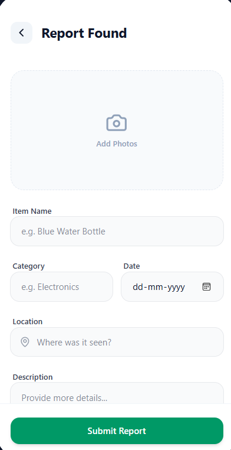
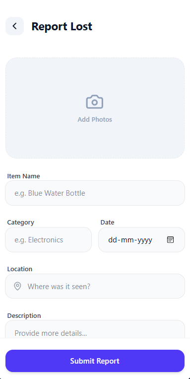
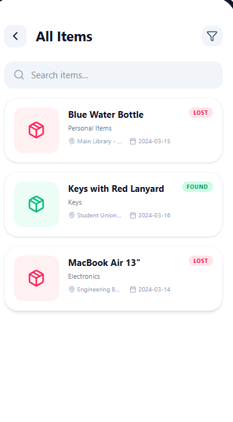

# Campus Lost and Found Portal - Android UI

This project contains the complete UI source code for the Campus Lost and Found Portal, built using **Kotlin** and **Jetpack Compose**.

## Project Structure

- `app/src/main/java/com/campus/lostfound/`
    - `MainActivity.kt`: Entry point.
    - `models/`: Data models for Lost and Found items.
    - `navigation/`: Navigation graph and route definitions.
    - `ui/screens/`:
        - `LoginScreen.kt`: Student/Admin login with role selection.
        - `HomeScreen.kt`: Main dashboard with navigation cards.
        - `ReportLostScreen.kt`: Form to report lost items.
        - `ReportFoundScreen.kt`: Form to report found items.
        - `ItemListScreen.kt`: Scrollable list of all reported items.
        - `ItemDetailScreen.kt`: Detailed view of a specific item.

## How to use in Android Studio

1. Create a new "Empty Compose Activity" project in Android Studio.
2. Set the package name to `com.campus.lostfound`.
3. Copy the files from this directory into your project's `java` folder.
4. Ensure you have the following dependencies in your `build.gradle`:
    - `androidx.navigation:navigation-compose`
    - `androidx.compose.material3:material3`
    - `androidx.compose.material:material-icons-extended`

## Features

- **Material 3 Design**: Modern look and feel.
- **Role-Based Login**: Separate flows for Students and Admins.
- **Responsive Layouts**: Uses `Column`, `Row`, and `LazyColumn` for dynamic sizing.
- **State Management**: Uses `remember` and `mutableStateOf` for local UI state.
- **Navigation**: Seamless transitions between screens using `NavHost`.

## Screenshort

  
  
  
  
  

