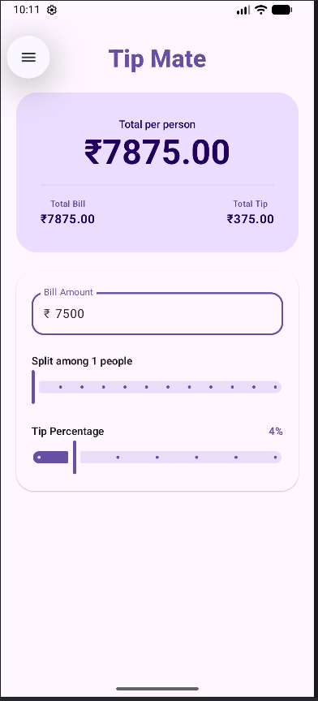

# 📱 Tip Mate —  Tip Calculator

**Tip Mate** is a polished, high-performance Android utility app built with **Jetpack Compose** and **Material 3**. It transforms the mundane task of calculating a bill into a smooth, interactive experience using gesture-based controls and real-time reactive UI.

---

## 🚀 Features

-   **Real-time Calculations:** See your total update instantly as you adjust values.
-   **Dynamic Splitting:** Divide the bill among up to 12 people with a simple slider.
-   **Interactive Tip Slider:** Move away from tedious typing with a fluid percentage slider (0% to 30%).
-   **Material 3 Aesthetic:** Built with the latest design system, featuring elevated cards, rounded surfaces, and high-contrast result displays.
-   **Edge-to-Edge Design:** Fully immersive layout that respects the Android status bar and navigation notch.

---

## 🛠️ Tech Stack

-   **Language:** [Kotlin](https://kotlinlang.org/)
-   **UI Framework:** [Jetpack Compose](https://developer.android.com/jetpack/compose)
-   **Design System:** [Material Design 3](https://m3.material.io/)
-   **State Management:** Unidirectional Data Flow (UDF) using `remember` and `mutableStateOf`.

---

## 📐 The Math Behind the App

The app calculates the share for each person using the following formula:

$$Total\ Per\ Person = \frac{Bill + (Bill \times \frac{Tip\ Percent}{100})}{Split\ Count}$$

---

## 📸 Preview

---

## 🏗️ Getting Started

### Prerequisites
* Android Studio **Ladybug** (2024.2.1) or newer.
* Kotlin 2.0+
* Android SDK Level 34+
